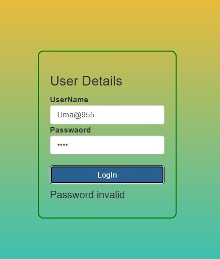

<ol>
 
  <li>
     
Cards-API

     
(using : html, bootstrap, Jquery, js)

     
  </li> 
  <li>
     
Tip calculator

      
(using : html, bootstrap, css, js)

     
  </li>
   <li>
      
Login Verify (it can show to user if userid wrong or password wrong) 

      
(using : html, bootstrap, css, js)

      
      
  </li>
</ol>

